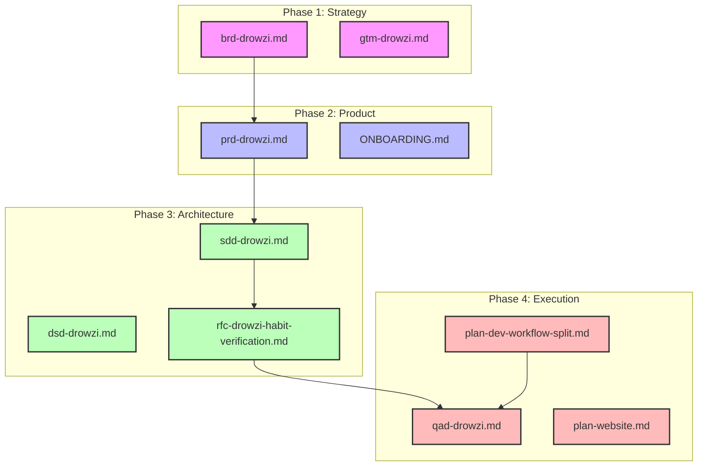

# Drowzi AI & Developer Orchestrator (`AGENT.md`)

Welcome, Agent / Developer! This orchestrator file serves as a high-level roadmap and reference guide for the entire documentation suite of **Drowzi**. Use this to quickly navigate the system architecture, business strategy, product details, and developer workflows.

---

## 🗺️ Documentation Directory Map

The documentation in this repository is structured into four distinct phases of the product and engineering lifecycle.

---

## 📂 File Directory Breakdown

### 🎯 Phase 1: Business Vision & Strategy
*   **[brd-drowzi.md](file:///C:/Users/User/CODERIST/drowzi/docs/brd-drowzi.md)** (Business Requirements Document)
    *   *Purpose:* Outlines Drowzi's brand personality (The Challenger/Personal Trainer), color psychology (Awakening Yellow, Grounded Brown, Pulse Orange), and customer problem-solution fit.
    *   *Key Focus:* High-energy gamification to defeat morning sleep inertia.
*   **[gtm-drowzi.md](file:///C:/Users/User/CODERIST/drowzi/docs/gtm-drowzi.md)** (Go-To-Market Plan)
    *   *Purpose:* Guides marketing strategy, user acquisition channels, launch timeline, and monetization models.

### 📋 Phase 2: Product & Feature Specifications
*   **[prd-drowzi.md](file:///C:/Users/User/CODERIST/drowzi/docs/prd-drowzi.md)** (Product Requirements Document)
    *   *Purpose:* Complete system features list, user stories, environmental setup requirements, and feature priority ranking (V1 vs. V2).
    *   *Key Standard:* Alarms and sensor/camera verification **must** function 100% offline.
*   **[ONBOARDING.md](file:///C:/Users/User/CODERIST/drowzi/docs/ONBOARDING.md)**
    *   *Purpose:* Detailed layout of the user's initial setup flow (Welcome screen -> name input -> alarm scheduling -> motion habit target).

### 🏗️ Phase 3: Technical Architecture & System Design
*   **[sdd-drowzi.md](file:///C:/Users/User/CODERIST/drowzi/docs/sdd-drowzi.md)** (System Design Document)
    *   *Purpose:* High-level engineering blueprints including the Expo (React Native) architecture, SQLite and AsyncStorage on-device storage, and local security.
*   **[dsd-drowzi.md](file:///C:/Users/User/CODERIST/drowzi/docs/dsd-drowzi.md)** (Database & State Schema Design)
    *   *Purpose:* Physical database schemas for local SQLite tables, AsyncStorage keys, and streak calculation logic.
*   **[rfc-drowzi-habit-verification.md](file:///C:/Users/User/CODERIST/drowzi/docs/rfc-drowzi-habit-verification.md)** (Verification Engine RFC)
    *   *Purpose:* Detailed specification of how on-device sensor gating works (MediaPipe Pose detection for push-ups, Barcode scanner for coffee bags, Voice parsing for motivational speeches).

### 🚀 Phase 4: Quality Assurance & Execution
*   **[plan-dev-workflow-split.md](file:///C:/Users/User/CODERIST/drowzi/docs/plan-dev-workflow-split.md)** (Hackathon Scoping & Split)
    *   *Purpose:* Crucial hackathon roadmap that scales down the product scope to **strictly offline local persistence** (AsyncStorage, bypassing Supabase and auth) to ensure maximum focus on a working, single-session demo.
*   **[qad-drowzi.md](file:///C:/Users/User/CODERIST/drowzi/docs/qad-drowzi.md)** (Quality Assurance & Test Matrix)
    *   *Purpose:* Comprehensive integration testing suites, test plans for offline resilience, and edge case coverage (e.g. app crashes mid-alarm).
*   **[plan-website.md](file:///C:/Users/User/CODERIST/drowzi/docs/plan-website.md)** (Marketing Website Spec)
    *   *Purpose:* Next.js static informational landing page specifications for app downloads.

---

## 💡 Core Architecture Philosophy: Offline-First
Drowzi is fundamentally designed to be **offline-first**. As an agent or developer working in this codebase:
1.  **AI & Inference:** Keep pose models (`assets/models`) local. Do **not** query external cloud APIs for verification.
2.  **Sensors:** Use device-level hardware APIs (`react-native-vision-camera`, `expo-notifications`).
3.  **Resilience:** All data persists locally in SQLite and AsyncStorage. Cloud synchronization (via Supabase) is deferred to V2.
