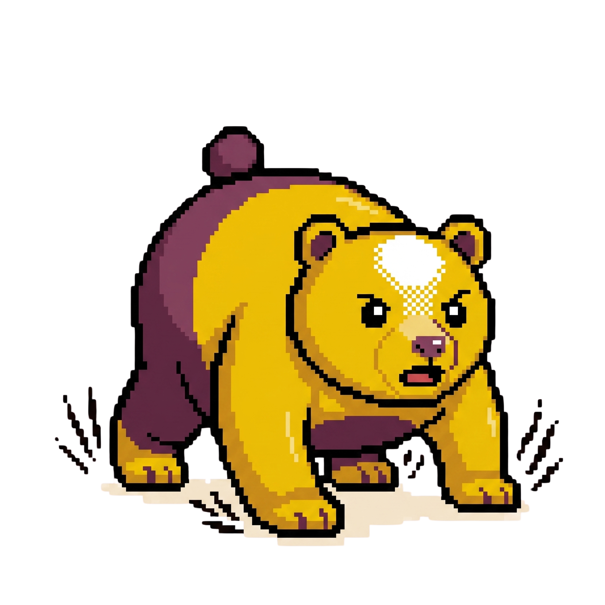

# Drowzi 🐻💤 → 🐻⚡

<p align="center">
  
</p>

<p align="center">
  <strong>The habit-gated wake-up app that turns your morning routine into a behavioral contract.</strong>
</p>

---

## 🚀 The Mission

Stop the snooze cycle once and for all. Drowzi is a mobile alarm app that won't turn off until you complete a real habit. No snooze, no swipe-to-dismiss—the habit is the off-switch. We target the chronic snoozer who has tried and failed to build morning routines by providing unavoidable accountability: your body has to move for the noise to stop.

## ✨ Key Features

- **Habit-Gated Alarm Engine:** Loud alarms that persist until verified completion of a habit.
- **Physical Habit Gate:** Verified push-ups, squats, or jumping jacks via camera pose detection and accelerometer.
- **Environmental Habit Gate:** Scan a specific registered barcode (e.g., your toothpaste or coffee bag) to prove you're out of bed.
- **Cognitive Habit Gate:** Read a motivational passage aloud via voice recognition to wake up your mind.
- **Mascot Evolution:** Your Drowzi mascot starts sleepy every morning and becomes progressively more energized as you build your habit streak.
- **Offline-First:** All habit verification happens on-device; your alarm will always fire and verify, even without a network connection.

## 🛠️ Tech Stack

- **Mobile:** [Expo](https://expo.dev/) (React Native), TypeScript, Expo Router.
- **Backend:** [Supabase](https://supabase.com/) (PostgreSQL, Auth, Edge Functions).
- **On-Device ML:** Google ML Kit (Pose Detection, Barcode Scanning).
- **Speech:** Native iOS/Android Speech Recognition APIs.
- **Local Storage:** Expo SQLite for offline-first persistence.

## 📂 Repo Layout

```text
drowzi/
├── apps/mobile/    # Expo Router mobile application (React Native)
├── website/        # Next.js 15 marketing landing page
├── docs/           # Comprehensive product & engineering documentation
└── INIT.md         # Brand narrative & problem statement
```

## 🏃 Getting Started

### Mobile App
1. Navigate to the mobile directory: `cd drowzi/apps/mobile`
2. Install dependencies: `npm install`
3. Start the development server: `npx expo start`

### Marketing Website
1. Navigate to the website directory: `cd drowzi/website`
2. Install dependencies: `npm install`
3. Run the development server: `npm run dev`

## 📖 Documentation

For a deep dive into the product vision and technical architecture, check out our docs:

- [**PRD** (Product Requirements Document)](docs/prd-drowzi.md) - Features, user stories, and success metrics.
- [**SDD** (System Design Document)](docs/sdd-drowzi.md) - Architecture, data models, and ML implementation.
- [**RFC: Habit Verification**](docs/rfc-drowzi-habit-verification.md) - Deep dive into the sensor/ML logic.

---

<p align="center">
  <em>Built for those who need more than just a bell to wake up.</em>
</p>
