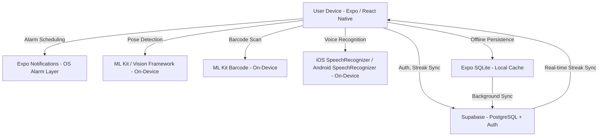

# System Design Document (SDD)

**Project:** Drowzi — Habit-Gated Wake-Up App
**Date:** 2026-05-15
**Version:** 0.1
**Owner:** delatorrecj
**PRD:** [prd-drowzi.md](prd-drowzi.md)

---

## 1. Architectural Vision & Principles

**Architecture style:** Expo (React Native) mobile client + Supabase BaaS (PostgreSQL + Auth + Realtime). Thin serverless edge functions for any server-side logic. No custom backend server in V1 — use Supabase's PostgREST and Edge Functions directly.

**Guiding principles:**
- Offline-first alarm core: the alarm must fire and the habit gate must function with zero network connectivity. All sensor verification is on-device.
- Server is for persistence only in V1: DB writes happen after habit completion to sync streak data. No server-side verification.
- On-device ML over API calls: pose detection, barcode scanning, and voice recognition all use platform SDKs to avoid latency, cost, and privacy concerns.
- Fail safe on alarm: if the app crashes during an active alarm, the system notification alarm (Expo Notifications) continues ringing. The habit gate is the app layer; the alarm is the OS layer.

**Key trade-offs made:**
- No custom backend server for V1 — Supabase handles all persistence; this limits complex server-side business logic but dramatically reduces infrastructure overhead for a solo build.
- Voice recognition uses platform OS APIs (no Whisper/cloud ASR) — free and offline-capable but less accurate on accented speech; documented V1 limitation.
- Streak sync is eventually consistent: offline completions sync when connectivity resumes. A local SQLite cache (via Expo SQLite) is the source of truth; Supabase is the backup/sync target.

---

## 2. High-Level Architecture



**Layers:**

| Layer | Technology | Responsibility |
|-------|------------|----------------|
| Client | Expo SDK 52, React Native 0.76, React 19 | All UI, alarm scheduling, sensor orchestration, on-device ML |
| Local Cache | Expo SQLite | Offline-first alarm configs, streak log, habit completion history |
| BaaS / API | Supabase (PostgREST) | User auth, cloud-persisted streak, alarm profiles (backup) |
| Compute (minimal) | Supabase Edge Functions (Deno) | Streak validation edge cases, push notification triggers |
| ML / Sensors | Google ML Kit, Apple Vision, OS Speech APIs | Pose detection, barcode scanning, voice recognition |
| Infrastructure | Expo EAS (builds + OTA updates), Supabase cloud | Build pipeline, database hosting |

---

## 3. Data Architecture

**Primary database:** PostgreSQL via Supabase — *reason: Supabase provides hosted Postgres with built-in auth, RLS, PostgREST API, and real-time subscriptions. Eliminates need for a custom API server.*
**Secondary / cache:** Expo SQLite (on-device) — *reason: Offline-first alarm and streak data. Never fails due to network issues.*
**Vector store:** N/A — no RAG or embedding features in V1.

**Core entities:**

```
users
  id:              UUID (Supabase auth.users foreign key)
  created_at:      TIMESTAMPTZ
  display_name:    TEXT
  mascot_level:    INTEGER DEFAULT 0

alarms
  id:              UUID PRIMARY KEY
  user_id:         UUID REFERENCES users(id)
  time:            TIME (HH:MM)
  recurrence:      JSONB (e.g., {"type": "weekly", "days": [1,2,3,4,5]})
  habit_type:      TEXT CHECK (habit_type IN ('motion', 'barcode', 'voice', 'pose', 'meditation'))
  habit_config:    JSONB (type-specific config: rep_target, barcode_value, passage_text, etc.)
  is_active:       BOOLEAN DEFAULT true
  created_at:      TIMESTAMPTZ DEFAULT now()

habit_logs
  id:              UUID PRIMARY KEY
  user_id:         UUID REFERENCES users(id)
  alarm_id:        UUID REFERENCES alarms(id)
  completed_at:    TIMESTAMPTZ
  habit_type:      TEXT
  success:         BOOLEAN
  method:          TEXT CHECK (method IN ('verified', 'fallback_timer', 'force_closed'))
  local_date:      DATE (user's local date, for streak calculation)

streaks
  id:              UUID PRIMARY KEY
  user_id:         UUID REFERENCES users(id)
  current_streak:  INTEGER DEFAULT 0
  longest_streak:  INTEGER DEFAULT 0
  last_active_date: DATE
  updated_at:      TIMESTAMPTZ DEFAULT now()
```

**Key relationships:**
- User has many Alarms (1:N)
- User has one Streak record (1:1)
- Alarm has many HabitLogs (1:N)
- HabitLog belongs to one Alarm and one User

**Caching strategy:**
- Expo SQLite: all alarms and habit_logs mirrored locally. Alarms are read from local DB at alarm fire time — zero network dependency.
- Supabase sync: habit_logs written to local DB immediately; synced to Supabase on next network connection via background sync job.
- Streak computed locally from local habit_logs; reconciled with Supabase streaks table on app foreground.

---

## 4. API Design & External Integrations

**API style:** Supabase PostgREST (auto-generated REST from schema) + Supabase Edge Functions for complex operations. React Native client uses `@supabase/supabase-js`.

**Internal endpoints (high-level):**

| Method | Path | Purpose |
|--------|------|---------|
| `POST` | `/auth/signup` | Create user account (Supabase Auth) |
| `POST` | `/auth/login` | Email + password login (Supabase Auth) |
| `GET` | `/rest/v1/alarms?user_id=eq.{id}` | Fetch all alarms for user |
| `POST` | `/rest/v1/alarms` | Create or update alarm |
| `POST` | `/rest/v1/habit_logs` | Log a habit completion event |
| `GET` | `/rest/v1/streaks?user_id=eq.{id}` | Fetch current streak |
| `POST` | `/functions/v1/recalculate-streak` | Server-side streak recalculation (Edge Function) |

**External integrations:**

| Service | Purpose | Rate Limits / Fallback |
|---------|---------|------------------------|
| Supabase Auth | User identity, session management | Built-in; on auth failure, app works offline with local session |
| Supabase PostgREST | Streak + alarm persistence | On 5xx, queue writes locally; retry on next foreground |
| Google ML Kit (Pose) | On-device push-up/pose detection | On model load failure → fallback to gyroscope timer gate |
| Google ML Kit (Barcode) | On-device barcode scanning | On failure → prompt user to re-scan |
| iOS/Android SpeechRecognizer | Voice gate recognition | On recognition failure → reset and re-listen; 3 retries before fallback timer gate |
| Expo Notifications | OS-level alarm scheduling and delivery | Alarm fires via OS; if notification permission revoked → in-app reminder to re-enable |
| Expo EAS | Build and OTA update delivery | Fallback: standard App Store/Play Store update |

---

## 5. Security & Authorization

**Authentication:** Supabase Auth — email + password (V1). OAuth (Google/Apple) deferred to V2.
**Session management:** Supabase JWT, stored in Expo SecureStore (encrypted device keychain). Session auto-refreshed; expires after 7 days of inactivity.
**Authorization model:** Row Level Security (RLS) on all Supabase tables. Policy: `auth.uid() = user_id` on alarms, habit_logs, and streaks. Users can only read and write their own data.

**Data protection:**
- PII encrypted at rest: Yes — Supabase (AWS-hosted) provides AES-256 at rest
- On-device: session token stored in Expo SecureStore (not AsyncStorage)
- Secrets management: Supabase anon key + project URL in `.env`; never committed. EAS secrets for build-time vars.
- Input validation: Zod schemas on all form inputs; habit_config JSONB validated client-side before upsert
- Camera/mic data: frames and audio are processed on-device only; never transmitted to any server

---

## 6. Infrastructure, CI/CD & Deployment

**Hosting:** Expo EAS (iOS + Android builds, OTA updates), Supabase cloud (managed Postgres + Auth + Edge Functions)

**Environments:**
- `dev`: Local Expo Go / Expo dev build; Supabase local instance via Supabase CLI (`supabase start`)
- `staging`: EAS Preview build (internal distribution); Supabase staging project
- `prod`: EAS Production build (App Store + Play Store); Supabase production project

**CI/CD:**
GitHub Actions pipeline:
1. `lint` — ESLint + Prettier check
2. `typecheck` — `tsc --noEmit`
3. `test` — Jest unit + integration tests
4. On `main` merge → EAS Preview build triggered (staging)
5. On `release/*` tag → EAS Production build + submission to App Store / Play Store

---

## 7. Non-Functional Requirements

| Requirement | Target | Notes |
|-------------|--------|-------|
| Alarm fire accuracy | ±30 seconds of scheduled time | Expo Notifications + OS scheduler; subject to Doze mode on Android |
| Habit gate latency (pose/barcode) | <100ms per frame | On-device ML; mid-range device baseline (Snapdragon 720G, A15) |
| Voice recognition response | <2s after speech ends | Platform ASR; network-independent |
| DB sync (habit log to Supabase) | <3s on Wi-Fi / LTE | Background sync after habit completion |
| App cold start to alarm home | <1.5s | React Native bundle optimization; Hermes engine |
| Uptime (Supabase) | 99.9% | Supabase SLA; app is fully functional offline |
| Max concurrent users V1 | 1,000 | Supabase free/pro tier handles this; scale up if exceeded |
| Data retention | User data retained indefinitely; raw habit_logs retained 2 years | Compliance with app store privacy requirements |

---

## 8. AI / Agent Architecture

**AI approach:** On-device inference only. No external LLM or cloud AI in V1. All ML is via platform SDKs.

**Model selection:**

| Task | Model / SDK | Reason |
|------|-------------|--------|
| Pose detection (push-ups, yoga) | Google ML Kit Pose Detection (iOS: BlazePose; Android: MoveNet via ML Kit) | Cross-platform, on-device, free, well-documented |
| Barcode scanning | Google ML Kit Barcode Scanning | Supports all standard formats (EAN-13, QR, UPC), on-device |
| Voice recognition | iOS SpeechRecognizer / Android SpeechRecognizer (via `expo-speech-recognition`) | Platform-native, supports offline mode on iOS, free |

**Context architecture:**
- No LLM context window; all ML inference is stateless per frame
- Pose detection: 15fps camera feed → landmarks → rep count state machine (managed in React context)
- Voice recognition: streaming audio → platform ASR → word match score against target passage

**Tool surface:** No external tool calls. All processing is local device APIs.

**HITL gates:**
- Camera/mic never activates without explicit user tap on the habit gate screen
- If confidence score for pose is below 0.6, the app shows "Reposition camera" — no silent auto-accept

**Token / cost budget:**

| Operation | Est. tokens | Est. cost | Monthly budget assumption |
|-----------|-------------|-----------|--------------------------|
| All ML inference | N/A (on-device) | $0 | No per-operation cloud cost |
| Supabase DB writes | N/A (row operations) | ~$0 on free tier (<500MB) | Free tier sufficient for V1 user volume |

**Fallback behavior:** If ML Kit fails to initialize (unsupported device, corrupted model): fall back to a gyroscope-based motion timer (device shaking for rep count) or a countdown timer (pose hold). Surface a "limited mode" banner. Log the fallback.

---

## Self-Check

- [x] Section 2 has a Mermaid architecture diagram
- [x] Section 3 defines all core entities with field types
- [x] Every external integration in Section 4 has a fallback strategy
- [x] Section 7 latency targets are specific numbers
- [x] Section 8 is filled (on-device ML documented)
- [x] Known V1 shortcuts documented as tech debt in Section 1 (no custom backend, OS ASR for voice)
- [x] This document answers *how* to build, not *what* (that's the PRD's job)

---

*Next document: [RFC — Habit Verification Engine](rfc-drowzi-habit-verification.md)*
