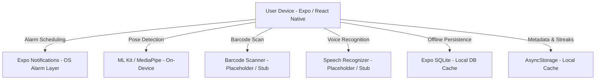

# System Design Document (SDD)

**Project:** Drowzi — Habit-Gated Wake-Up App
**Date:** 2026-05-15
**Version:** 0.1
**Owner:** delatorrecj
**PRD:** [prd-drowzi.md](prd-drowzi.md)
## 1. Architectural Vision & Principles

**Architecture style:** Local-only Expo (React Native) mobile client. All data (alarms, completion logs, streaks) is persisted on-device using Expo SQLite and AsyncStorage. There is no cloud backend, user authentication, or server synchronization in V1.

**Guiding principles:**

- Absolute offline capability: The app must function perfectly with zero network connectivity. All alarm scheduling, firing, and habit verification (such as camera pose detection) are executed locally.
- On-device ML: ML inference (MediaPipe / Google ML Kit for pose detection) runs entirely on the device. No video frames, audio, or metadata leave the phone.
- Fail-safe alarms: If the app is closed or crashed, background notification schedulers (Expo Notifications) manage alarm delivery. Reopening the app from a notification forces routing to the active habit gate.

**Key trade-offs made:**

- Local-only storage: Eliminates cloud hosting costs, authentication complexity, and security risks. However, users will lose their streak history if they uninstall the app or switch devices.
- Native capabilities & simulators: Focuses heavily on on-device sensors. On web/simulator builds, fallback simulation triggers are provided so that features can still be demoed and tested.

---

## 2. High-Level Architecture


```mermaid
graph TD
    A[User Device - Expo / React Native] -->|Alarm Scheduling| C[Expo Notifications - OS Alarm Layer]
    A -->|Pose Detection| D[ML Kit / MediaPipe - On-Device]
    A -->|Barcode Scan| E[Barcode Scanner - Placeholder / Stub]
    A -->|Voice Recognition| F[Speech Recognizer - Placeholder / Stub]
    A -->|Offline Persistence| G[Expo SQLite - Local DB Cache]
    A -->|Metadata & Streaks| H[AsyncStorage - Local Cache]
```

**Layers:**

| Layer             | Technology                                      | Responsibility                                                    |
| ----------------- | ----------------------------------------------- | ----------------------------------------------------------------- |
| Client            | Expo SDK 52, React Native 0.76, React 19        | All UI, alarm scheduling, sensor orchestration, on-device ML      |
| Local Storage     | Expo SQLite & AsyncStorage                      | Offline-first alarm configs, streak calculations, habit completion history, onboarding state |
| ML / Sensors      | Google ML Kit / MediaPipe (Pose)                | Pose detection (other gates are stubbed out as placeholders)      |
| Infrastructure    | Expo EAS (builds + OTA updates)                 | Build pipeline and deployment distribution                        |

---

## 3. Data Architecture

**Primary database:** Expo SQLite (on-device) — *reason: Offline-first alarm and streak data. Never fails due to network issues.*
**Secondary / metadata store:** AsyncStorage (on-device) — *reason: Lightweight configuration metadata (like display name, onboarding progress, recent habit logs) cache.*
**Vector store:** N/A — no RAG or embedding features in V1.

**Core entities (AsyncStorage):**

```typescript
interface Alarm {
  id: string;
  time: string;           // HH:MM format
  days: number[];         // Recurrence days (0-6)
  habitType: 'motion' | 'barcode' | 'voice' | 'pose' | 'meditation';
  habitConfig: Record<string, any>;
  isActive: boolean;
  label?: string;
}

interface StoredLog {
  id: string;
  alarmId: string;
  habitType: string;
  success: boolean;
  method: 'verified' | 'fallback_timer' | 'force_closed';
  localDate: string;      // YYYY-MM-DD
  completedAt: string;    // ISO8601 string
}
```

**Core entities (SQLite):**

```sql
CREATE TABLE IF NOT EXISTS habit_config (
  alarm_id TEXT PRIMARY KEY NOT NULL,
  habit_type TEXT NOT NULL,
  rep_target INTEGER NOT NULL,
  updated_at TEXT NOT NULL
);

CREATE TABLE IF NOT EXISTS habit_logs (
  id INTEGER PRIMARY KEY AUTOINCREMENT,
  alarm_id TEXT NOT NULL,
  habit_type TEXT NOT NULL,
  success INTEGER NOT NULL,
  method TEXT NOT NULL,
  local_date TEXT NOT NULL,
  created_at TEXT NOT NULL
);
```

**Key relationships:**
- An Alarm has zero or more associated `habit_logs` records (identified by `alarm_id`).
- Streak calculation is performed dynamically by parsing the list of successful local `StoredLog` records.

**Persistence Strategy:**
- All data is local. SQLite is used to store habit configurations and logs for high-reliability structured querying.
- AsyncStorage is used to store onboarding flags, basic user profile metadata (like display name), active Alarm settings, and dynamic history logs.

---

## 4. API Design & External Integrations

**API style:** Local-only library APIs. There is no remote network API or server interface in V1.

**Internal Service APIs:**

| Module | Location | Purpose |
| --- | --- | --- |
| `alarmStore` | `src/platform/alarmStore.ts` | Handles local persistence (AsyncStorage) for adding, updating, and deleting Alarm profiles. |
| `alarmScheduler` | `src/platform/alarmScheduler.ts` | Integrates with `expo-notifications` to schedule and cancel OS-level alarms. |
| `recordCompletion` | `src/platform/recordCompletion.ts` | Records successful habit completions in AsyncStorage and calculates streak counters dynamically. |
| `habitSqlite` | `src/platform/habitSqlite.ts` | Provides structured SQLite tables for storing fine-grained configuration and logs. |

**External integrations:**

| Service | Purpose | Fallback |
| --- | --- | --- |
| Google ML Kit / MediaPipe | On-device pose detection for verification | Gyroscope-based shaking or manual countdown fallback timer |
| Expo Notifications | OS-level notification triggers for background alarms | In-app notification dispatcher fallback if permission is revoked |
| Expo EAS | App bundle builds and OTA updates | App Store / Google Play manual updates |

---

## 5. Security & Authorization

**Authentication:** None. The app operates entirely in a local anonymous user context in V1.

**Session management:** N/A.

**Authorization model:** N/A.

**Data protection:**
- PII and local settings are cached in AsyncStorage.
- Sensitive credentials or tokens are stored in Expo SecureStore (if needed).
- Zod schemas are used for input validation on form submittals before writing to database stores.
- Camera frames processed during habit verification are loaded entirely in volatile memory and destroyed immediately. No image/video data is saved to disk or transmitted over the network.

---

## 6. Infrastructure, CI/CD & Deployment

**Hosting:** N/A (Client-only mobile app).

**Environments:**
- `dev`: Local Expo Go or local Expo development builds.
- `prod`: EAS Production build distributed via Apple App Store and Google Play Store.

**CI/CD:**
GitHub Actions pipeline:
1. `lint` — ESLint + Prettier check
2. `typecheck` — `tsc --noEmit`
3. `test` — Jest unit tests for storage modules, streak calculator, and state hooks.
4. EAS build trigger on release tags.

---

## 7. Non-Functional Requirements

| Requirement | Target | Notes |
| --- | --- | --- |
| Alarm fire accuracy | ±30 seconds of scheduled time | Expo Notifications + OS alarm scheduler; subject to background restrictions |
| Habit gate latency (pose) | <100ms per frame | On-device ML inference on mid-range devices |
| SQLite query latency | <50ms | Basic on-device index lookup queries |
| App cold start to alarm home | <1.5s | Hermes engine bundle optimizations |
| Data retention | Indefinite (local-only) | Persisted until the user uninstalls the app or clears app data |

---

## 8. AI / Agent Architecture

**AI approach:** On-device inference only. No external LLM or cloud AI in V1. All ML is via platform SDKs.

**Model selection:**


| Task                            | Model / SDK                                                                     | Reason                                                     |
| ------------------------------- | ------------------------------------------------------------------------------- | ---------------------------------------------------------- |
| Pose detection (push-ups, yoga) | Google ML Kit Pose Detection (iOS: BlazePose; Android: MoveNet via ML Kit)      | Cross-platform, on-device, free, well-documented           |
| Barcode scanning                | Google ML Kit Barcode Scanning                                                  | Supports all standard formats (EAN-13, QR, UPC), on-device |
| Voice recognition               | iOS SpeechRecognizer / Android SpeechRecognizer (via `expo-speech-recognition`) | Platform-native, supports offline mode on iOS, free        |


**Context architecture:**

- No LLM context window; all ML inference is stateless per frame
- Pose detection: 15fps camera feed → landmarks → rep count state machine (managed in React context)
- Voice recognition: streaming audio → platform ASR → word match score against target passage

**Tool surface:** No external tool calls. All processing is local device APIs.

**HITL gates:**

- Camera/mic never activates without explicit user tap on the habit gate screen
- If confidence score for pose is below 0.6, the app shows "Reposition camera" — no silent auto-accept

**Token / cost budget:**


| Operation          | Est. tokens          | Est. cost                 | Monthly budget assumption               |
| ------------------ | -------------------- | ------------------------- | --------------------------------------- |
| All ML inference   | N/A (on-device)      | $0                        | No per-operation cloud cost             |
| Local data writes  | N/A (local SQLite)   | $0                        | Free. Client device storage only.       |


**Fallback behavior:** If ML Kit fails to initialize (unsupported device, corrupted model): fall back to a gyroscope-based motion timer (device shaking for rep count) or a countdown timer (pose hold). Surface a "limited mode" banner. Log the fallback.

---

## Self-Check

- Section 2 has a Mermaid architecture diagram
- Section 3 defines all core entities with field types
- Every external integration in Section 4 has a fallback strategy
- Section 7 latency targets are specific numbers
- Section 8 is filled (on-device ML documented)
- Known V1 shortcuts documented as tech debt in Section 1 (no custom backend, OS ASR for voice)
- This document answers *how* to build, not *what* (that's the PRD's job)

---

*Next document: [RFC — Habit Verification Engine](rfc-drowzi-habit-verification.md)*